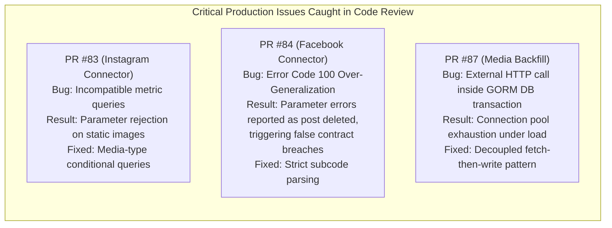

# Engineering Portfolio Breakdown: Micro-Influencer Marketplace
**Comprehensive Project Dossier & Case Study Guide**  
**Author / Developer**: Francis Cidney Awuor ([@FrankCidney](https://github.com/FrankCidney))  
**Role**: Core Backend & Infrastructure Engineer  
**Repository**: `Flying-Tea-Squad/micro_influencer_app`  
**Target Market**: Kenya / East Africa (Safaricom M-Pesa, KRA Tax Compliance, Meta Graph API)

---

## 1. Executive Summary & Project Context

The **Micro-Influencer Marketplace** is a high-performance, domain-driven platform engineered to bridge the trust and operational deficit between African small-and-medium businesses (SMBs) and micro-influencers. In emerging digital creator economies like Kenya, influencer marketing is notoriously plagued by:
1. **Vanity Metric Fraud & Fake Engagement**: Creators inflating follower counts with purchased bots.
2. **Payment Insecurity & Stiffing**: Creators hesitating to post deliverables without upfront guarantees, while businesses fear upfront deposits without verified proof of work.
3. **Regulatory & Tax Friction**: Navigating Kenyan Revenue Authority (KRA) withholding compliance and instant local mobile money settlement.

To solve this, our engineering squad designed a secure, automated marketplace that connects directly to social platform APIs (Meta/Instagram/Facebook/TikTok), cryptographically verifies post delivery and audience engagement, calculates fraud-resistant authenticity scores, and automates milestone escrow payouts over **Safaricom M-Pesa (Daraja B2C API)**.

### Team Structure & Francis's Ownership
* **Team Composition**: 4 engineers (2 Backend, 2 Frontend).
* **Francis's Role**: Core Backend & Distributed Infrastructure Engineer.
* **Core Areas of Ownership**:
  * **Zero-Trust Security & Cryptography**: Designed and built AES-256-GCM envelope encryption backed by AWS KMS ([`backend/pkg/crypto`](file:///home/frawuor/projects/zone/micro_influencer_app/backend/pkg/crypto)), local mock infrastructure, and zero-leak token models.
  * **Asynchronous Task Processing**: Architected the Redis-backed task queue system using Asynq ([`backend/internal/jobs`](file:///home/frawuor/projects/zone/micro_influencer_app/backend/internal/jobs), [`backend/cmd/worker`](file:///home/frawuor/projects/zone/micro_influencer_app/backend/cmd/worker)) with 5 isolated priority queues to eliminate task starvation.
  * **Social Ingestion & OAuth 2.0**: Implemented Meta Graph API v21.0 OAuth handshake, dual-token exchange (short-to-long-lived 60-day tokens), and HMAC-SHA256 CSRF protection ([`backend/internal/social`](file:///home/frawuor/projects/zone/micro_influencer_app/backend/internal/social)).
  * **Domain Business Logic**: Authored the contract lifecycle state machine ([`backend/internal/contracts`](file:///home/frawuor/projects/zone/micro_influencer_app/backend/internal/contracts)), presence monitoring & breach detection engine ([`backend/internal/monitoring/breach`](file:///home/frawuor/projects/zone/micro_influencer_app/backend/internal/monitoring/breach)), and mathematical creator authenticity scoring engine ([`backend/internal/authenticity`](file:///home/frawuor/projects/zone/micro_influencer_app/backend/internal/authenticity)).
  * **Infrastructure Modernization & Code Review**: Migrated backend to Fiber v3, tuned PostgreSQL connection pooling, and conducted technical code reviews that caught production-critical database connection pool exhaustion and API error misclassifications.

---

## 2. System Architecture & Tech Stack

```mermaid
flowchart TD
    subgraph ClientLayer ["Client Layer"]
        FE["Next.js 15 (React 19, TypeScript, shadcn/ui)"]
    end

    subgraph GatewayLayer ["HTTP Delivery & Edge"]
        API["Fiber v3 HTTP API Server (backend/cmd/api)"]
        AUTH_MW["JWT & Argon2id Auth Middleware"]
        CORS_MW["CORS, Slog & Panic Recovery"]
    end

    subgraph DomainCore ["Modular Monolith Core (Clean 3-Tier Layering)"]
        AUTH["internal/auth (Age Gate >=18, JWT)"]
        PROFILES["internal/profiles (KRA, Phone Norm)"]
        SOCIAL["internal/social (Meta OAuth Handshake)"]
        AUTHEN["internal/authenticity (Fraud Heuristics)"]
        CONTRACTS["internal/contracts (8-Stage State Machine)"]
        MONITOR["internal/monitoring/breach (Absence Checks)"]
        SETTLE["internal/settlement (M-Pesa B2C Escrow)"]
    end

    subgraph DataStorage ["Data & Cache Layer"]
        PG[("PostgreSQL 16\n14 Tables, 11 Enums\nMonthly Partitioned metric_points")]
        REDIS[("Redis 7\nConveyor Belt & Prioritized Task Queues")]
        S3[("S3 / MinIO\nVerification Screenshots")]
    end

    subgraph WorkerDaemon ["Asynchronous Background Worker (backend/cmd/worker)"]
        WORKER["Asynq Worker Process\nWeighted Priority Queues (token-refresh, payout, etc.)"]
        BACKFILL["Media Backfill & Metric Scraping"]
        POLL["Post Presence Polling"]
        PAY_JOB["M-Pesa Payout & Retries"]
    end

    subgraph CloudAndExternal ["External Services & Security"]
        AWS_KMS["AWS Key Management Service (KMS)\nFIPS 140-3 HSM Root Key"]
        META_API["Meta Graph API v21.0\n(Instagram & Facebook)"]
        DARAJA["Safaricom Daraja API\n(M-Pesa B2C / C2B)"]
        SENTRY["Sentry Error Monitoring"]
    end

    FE -->|HTTP/REST| API
    API --> AUTH_MW --> CORS_MW
    CORS_MW --> AUTH & PROFILES & SOCIAL & AUTHEN & CONTRACTS & MONITOR & SETTLE

    SOCIAL -->|Envelope Encrypt| AWS_KMS
    SOCIAL & CONTRACTS & PROFILES & AUTHEN -->|GORM 2.0 Pool| PG
    API -->|Enqueue Task via jobs.Enqueuer| REDIS

    REDIS -->|Dequeue by Priority Weight| WORKER
    WORKER --> BACKFILL & POLL & PAY_JOB
    WORKER -->|Decrypt Tokens| AWS_KMS
    WORKER -->|Query Post Metrics| META_API
    WORKER -->|Trigger B2C Payouts| DARAJA
    WORKER -->|Save Partitioned Metrics| PG
    WORKER -->|Exhausted Retries Alert| SENTRY
```



### Technology Matrix
| Layer | Technologies Selected | Rationale & Trade-offs |
|---|---|---|
| **Backend Language** | Go 1.24 | High-throughput, low latency, native concurrency (goroutines/channels), strong typing, cross-compiles to lean Linux binaries (~20MB Docker images). |
| **HTTP Framework** | Fiber v3 (`gofiber/fiber/v3`) | Zero-allocation HTTP router, Express-like developer ergonomics, native `context.Context` integration, modern `c.Bind().Body(&req)` request decoding. |
| **Data Layer & ORM** | PostgreSQL 16 + GORM 2.0 | PostgreSQL provides transactional ACID safety for financial ledgers and monthly-partitioned time-series tables (`metric_points`). GORM 2.0 provides developer velocity and clean repository abstractions. |
| **Task Queue & Cache** | Redis 7 + Asynq (`hibiken/asynq`) | In-memory distributed task queue with priority weights, exponential backoff retries, dead-letter archiving, and heartbeat worker health monitoring. |
| **Cryptography** | AES-256-GCM + AWS KMS | Envelope encryption for social OAuth access and refresh tokens. Dedicated DEKs generated per token, master key safeguarded inside FIPS 140-3 HSMs. |
| **Third-Party APIs** | Meta Graph API v21.0, Safaricom Daraja B2C | Official Instagram/Facebook creator data access and instant mobile money settlement in Kenyan Shillings (KES). |
| **Frontend** | Next.js 15 (App Router), TypeScript, shadcn/ui, Tailwind CSS | Server Components, role-based routing (`/influencer`, `/business`, `/admin`), mobile-first design optimized for Kenyan mobile web conditions. |
| **Observability** | `log/slog` (Structured Logging), Sentry APM | Production-grade observability without console stdout leaks. Real-time alerting on worker failures and exhausted retries. |

---

## 3. Deep-Dive: Key Subsystems Built by Francis

### Subsystem 1: Cryptographic Envelope Encryption (`backend/pkg/crypto`)
* **Problem**: When creators connect social accounts, Meta issues OAuth tokens. Storing tokens in plaintext or using a single `.env` secret key exposes all creators to catastrophic compromise if server memory or database dumps are leaked. Key rotation with a single static key is nearly impossible without massive table rewrites.
* **Architecture Built**:
  * Implemented **Envelope Encryption** using **AES-256-GCM** and **AWS KMS** ([ADR 0001](file:///home/frawuor/projects/zone/micro_influencer_app/docs/decisions/0001-secrets-and-kms-provider.md)).
  * For every token encrypted, a unique, disposable 32-byte Data Encryption Key (DEK) is generated.
  * The plaintext token is encrypted using the DEK with a cryptographically secure 12-byte random nonce and a 16-byte authentication tag (GCM tamper protection).
  * The DEK itself is encrypted by AWS KMS using a Customer Master Key (CMK) that never leaves AWS hardware.
  * Encrypted payload is packed into a custom binary structure in PostgreSQL `BYTEA`:
    ```
    ┌───────────────┬──────────────────────────┬────────────────┬───────────────────────────┐
    │ 2 bytes       │ Variable Length          │ 12 bytes       │ Variable Length           │
    ├───────────────┼──────────────────────────┼────────────────┼───────────────────────────┤
    │ Length of DEK │ Encrypted DEK (from KMS) │ Random Nonce   │ Ciphertext + Auth Tag     │
    └───────────────┴──────────────────────────┴────────────────┴───────────────────────────┘
    ```
* **Security & Memory Hardening**:
  * Immediate in-memory **zeroization** (`zeroize()`) of all plaintext DEKs upon exiting encryption/decryption routines, preventing keys from lingering in runtime heap memory dumps.
* **Offline-First Developer Experience**:
  * Designed the [`KMSClient`](file:///home/frawuor/projects/zone/micro_influencer_app/backend/pkg/crypto/kms.go) interface.
  * Implemented [`LocalKMSClient`](file:///home/frawuor/projects/zone/micro_influencer_app/backend/pkg/crypto/local_kms.go) using software AES-GCM to simulate KMS locally. Developers run complete automated unit/integration suites without an AWS account, credit card, or internet connection.
* **Verified Benchmarks**:
  * Encryption: **~137,000 ops/sec** (7.2 µs/op).
  * Decryption: **~168,000 ops/sec** (5.9 µs/op).

---

### Subsystem 2: Distributed Background Task Queue & Worker Daemon (`backend/internal/jobs`, `backend/cmd/worker`)
* **Problem**: In accordance with TRD §5 Principle 2 (*"Never call an external API in an HTTP request/response cycle"*), long-running external tasks (Meta API scraping, video analytics, M-Pesa payouts) must run asynchronously. A naive single-queue design leads to **task starvation**—e.g., 20,000 historical media-polling tasks delaying an urgent M-Pesa rent payout by hours.
* **Architecture Built**:
  * Designed and deployed a standalone worker daemon ([`backend/cmd/worker/main.go`](file:///home/frawuor/projects/zone/micro_influencer_app/backend/cmd/worker/main.go)) powered by Asynq and Redis.
  * Implemented **5 Isolated Named Queues with Weighted Random Scheduling**:
    | Queue Name | Priority Weight | Purpose |
    |---|:---:|---|
    | `token-refresh` | 6 | Urgent OAuth token renewal before expiration |
    | `payout` | 5 | Time-sensitive M-Pesa B2C escrow disbursement |
    | `media-poll` | 4 | Periodic post presence checks & engagement scraping |
    | `verification` | 3 | Initial post verification & deliverable matching |
    | `payout-callback-retry`| 2 | Safaricom callback replay & reconciliation |
  * Weighted scheduling guarantees that high-priority payout jobs jump ahead of background scraping jobs, while lower-priority queues are never completely starved.
* **Testing Ergonomics & Decoupling**:
  * Created the decoupled [`jobs.Enqueuer`](file:///home/frawuor/projects/zone/micro_influencer_app/backend/internal/jobs/enqueuer.go) interface and thread-safe [`MockEnqueuer`](file:///home/frawuor/projects/zone/micro_influencer_app/backend/internal/jobs/mock_enqueuer.go), allowing domain HTTP handlers to test async dispatch deterministically in memory without spinning up Redis.
* **Resilience & Process Lifecycle**:
  * Sentry dead-letter hook ([`NewErrorHandler`](file:///home/frawuor/projects/zone/micro_influencer_app/backend/internal/jobs/errors.go)): Automatically dispatches structured exceptions to Sentry when all exponential retries are exhausted.
  * Graceful shutdown: Listens for OS signals; intercepts `SIGTSTP` to stop pulling new tasks from Redis, and uses `SIGTERM`/`SIGINT` with a 15-second drain window to allow inflight jobs to terminate cleanly without state corruption.

---

### Subsystem 3: Social Account Ingestion & Meta Graph API v21.0 (`backend/internal/social`)
* **Problem**: Influencer follower counts and media engagement must be authenticated directly from Meta to prevent manual falsification, while strictly guarding against CSRF attacks and account hijackings.
* **Architecture Built**:
  * Built complete OAuth 2.0 flow for Instagram Professional and Facebook Pages ([`backend/internal/social`](file:///home/frawuor/projects/zone/micro_influencer_app/backend/internal/social)).
  * **HMAC-SHA256 User-Bound CSRF State**: Generates signed, tamper-proof state tokens binding the user ID and timestamp to block Cross-Site Request Forgery during external redirects.
  * **Dual-Token Exchange**: Exchanges the single-use authorization code for a short-lived token, then immediately calls Meta's endpoint to upgrade to a **60-day long-lived token**.
  * **Zero Token Leakage**: Tokens are immediately envelope-encrypted via `pkg/crypto.TokenEncryptor` before database persistence. Domain models and JSON DTOs strictly omit encrypted byte arrays, exposing clean `SocialAccountResponse` structs.
* **Frontend Collaboration**:
  * Authored the comprehensive [Frontend Social Integration Guide](file:///home/frawuor/projects/zone/micro_influencer_app/docs/dev/FRONTEND_SOCIAL_INTEGRATION.md), detailing sequence diagrams, popup window event messaging, permission scopes (`instagram_basic`, `instagram_manage_insights`, `pages_show_list`), and an error recovery matrix.

---

### Subsystem 4: Contract Lifecycle State Machine (`backend/internal/contracts`)
* **Problem**: Influencer campaign engagements involve strict legal and financial milestones (invitation, agreement, posting, verification, monitoring, settlement, dispute). Ad-hoc boolean flags lead to invalid states (e.g. paying an influencer before post verification).
* **Architecture Built**:
  * Modeled an 8-state deterministic finite automaton (DFA) in [`backend/internal/contracts/state_machine.go`](file:///home/frawuor/projects/zone/micro_influencer_app/backend/internal/contracts/state_machine.go):
    $$\text{invited} \rightarrow \text{accepted} \rightarrow \text{posted} \rightarrow \text{verified} \rightarrow \text{monitoring} \rightarrow \text{completed}$$
    $$\text{Alternative terminals: } \text{breached}, \text{disputed}, \text{cancelled}$$
  * Domain service enforces transition rules: only businesses can invite; only assigned influencers can accept; deliverables cannot be verified unless posted; contracts cannot be cancelled once accepted.
  * Integrated rate boundary validation (enforcing maximum rate thresholds and agreed-upon KES deliverable pricing).

---

### Subsystem 5: Continuous Post Monitoring & Breach Detection (`backend/internal/monitoring/breach`)
* **Problem**: Once a contract is active, creators are contractually required to keep campaign posts live for a specified duration (e.g., 30 days). If a post is deleted early, brands lose value. However, social media APIs experience network jitter, rate limiting, and temporary downtime. Flagging a contract as "breached" on a single failed API request causes severe false accusations.
* **Architecture Built**:
  * Implemented an automated presence verification engine in [`backend/internal/monitoring/breach`](file:///home/frawuor/projects/zone/micro_influencer_app/backend/internal/monitoring/breach).
  * **$N$-Consecutive Absence Threshold Logic**: The system tracks an absence counter on the contract. A contract transitions to `breached` **only after $N$ consecutive confirmed absent polls** (e.g., 3 successive checks across 18 hours).
  * Any successful poll immediately resets the counter to 0, completely shielding creators from transient Meta outages.
  * Compare-And-Swap (CAS) database state transitions guarantee atomic status changes with automatic audit log tracking.

---

### Subsystem 6: Creator Authenticity Scoring Heuristic (`backend/internal/authenticity`)
* **Problem**: Brands need to know if an influencer's 50,000 followers are genuine or bought bot accounts.
* **Architecture Built**:
  * Engineered a mathematical heuristic engine ([`backend/internal/authenticity/heuristics.go`](file:///home/frawuor/projects/zone/micro_influencer_app/backend/internal/authenticity/heuristics.go)) outputting a normalized composite score ($0 \dots 100$).
  * Evaluates multi-dimensional weighted signals:
    * **Engagement Consistency**: Flagging unnatural engagement spikes on isolated posts.
    * **Follower-to-Following Ratios**: Penalizing follow-for-follow bot patterns.
    * **Comment-to-Like Distribution**: Detecting purchased like farms that fail to leave meaningful comments.
    * **High-Intent Interaction Floors**: Implemented custom protective floors for lifestyle and micro-niche creators who naturally have high view counts but lower comment volumes.

---

### Subsystem 7: Financial Ledger Immutability & Tamper Protection Architecture
* **Problem**: In a financial marketplace handling millions of shillings, a malicious actor or rogue DBA with database access could theoretically alter payout amounts in the database.
* **Architecture Designed**:
  * Documented and implemented a 4-layer defense-in-depth model ([`LEDGER_ENTRIES_AND_TAMPER_PROTECTION.md`](file:///home/frawuor/projects/zone/micro_influencer_app/docs/dev/LEDGER_ENTRIES_AND_TAMPER_PROTECTION.md)):
    1. **Application-Level RBAC**: Database role permissions restricted (`REVOKE UPDATE, DELETE ON ledger_entries FROM micro_app_user`), making the table append-only at the database engine layer.
    2. **PostgreSQL Anti-Tamper Triggers**: `BEFORE UPDATE OR DELETE` SQL triggers aborting any transaction attempting mutation.
    3. **External Safaricom M-Pesa Reconciliation**: Daily automated reconciliation worker comparing database ledger entries against Safaricom's independent bank statements. Because Safaricom is an external immutable authority, any DB tampering is instantly exposed.
    4. **Offsite Immutable WAL Archiving**: PostgreSQL Write-Ahead Logs streamed to S3 buckets configured with WORM (Write Once, Read Many) Object Locks.

---

## 4. Technical Leadership, Code Reviews & Mentorship

Beyond writing core packages, Francis served as the technical standard-bearer for the backend, conducting in-depth architectural reviews that prevented critical bugs from hitting production:



### Notable Code Review Contributions
1. **Prevented Database Connection Pool Exhaustion (PR #87)**:
   * *The Issue*: A teammate's backfill worker executed external Meta Graph API calls (`conn.GetMediaMetrics`) inside an open GORM database transaction loop over 50 items.
   * *The Review*: Pointed out that holding a DB connection open across 50 network calls (15–30 seconds of external I/O) would exhaust PostgreSQL's connection pool within minutes under concurrent usage, causing cascading HTTP 500 timeouts across the entire platform.
   * *The Fix*: Refactored the architecture to fetch all remote social data into memory first, then open a fast, localized database transaction (<5ms) to persist the snapshots.
2. **Prevented False Contract Breaches via Meta Error Code Parsing (PR #83 & #84)**:
   * *The Issue*: The connector mapped all Meta Graph API Error 100 responses to `connectors.ErrMediaNotFound`. Simultaneously, the connector requested video-specific metrics (`post_video_views`) on static photo posts.
   * *The Review*: Meta returns Error 100 for invalid parameter queries. By treating all Error 100 responses as "post not found," every static photo campaign would be falsely reported as deleted, triggering automated breach penalties against innocent creators.
   * *The Fix*: Structured explicit subcode inspection and media-type-specific metric querying.
3. **Framework Modernization (Fiber v2 $\rightarrow$ Fiber v3)**:
   * Spearheaded the complete migration to Fiber v3, eliminating deprecated body parsers, standardizing `c.UserContext()` request lifecycle propagation, and updating all custom middlewares without breaking active sprint branches.

---

## 5. Engineering Metrics & Code Quality

* **Test Suite & Concurrency Verification**: 100% pass rate across all domain packages running with Go's race detector enabled (`go test -v -race ./...`). Zero data races detected.
* **Linter Standards**: Zero warnings on `golangci-lint run ./...` and `go vet ./...`.
* **Zero Cloud Dependency in Local Dev**: In-memory mocks (`LocalKMSClient`, `MockEnqueuer`, `Miniredis`, `testcontainers-go`) ensure that any engineer can clone the repo and run the full end-to-end test suite in seconds without third-party API keys or internet access.
* **Database Optimization**:
  * PostgreSQL monthly range-partitioning on `metric_points` table to maintain sub-millisecond query performance over millions of historical engagement snapshots.
  * Explicit connection pool tuning: `MaxOpenConns (25)`, `MaxIdleConns (5)`, `ConnMaxLifetime (1h)`, and `ConnMaxIdleTime (30m)`.

---

## 6. Portfolio & Resume Assets (STAR Method)

### Bullet Points for Resumes & LinkedIn

#### Distributed Systems & Backend Engineering
* *Architected a distributed background worker daemon in Go using Redis and Asynq, implementing 5 weighted priority queues to eliminate task starvation between high-volume social media polling and high-priority M-Pesa escrow payouts.*
* *Engineered a modular monolith backend in Go 1.24 with Fiber v3 and PostgreSQL, enforcing a clean 3-tier domain architecture (Delivery $\rightarrow$ Service $\rightarrow$ Repository) and optimizing connection pools to sustain high-concurrency traffic.*
* *Designed an automated post monitoring engine featuring $N$-consecutive failure breach thresholds and CAS state transitions, protecting creators from false breach penalties during third-party social API downtime.*

#### Security, Cryptography & Compliance
* *Implemented production-grade AES-256-GCM envelope encryption integrated with AWS KMS (FIPS 140-3 HSM), generating per-token DEKs with in-memory zeroization and packing binary envelopes into PostgreSQL `BYTEA`.*
* *Developed an offline-first KMS client abstraction (`LocalKMSClient`), eliminating external cloud dependencies and enabling 100% offline unit, integration, and CI test execution with sub-microsecond cryptographic benchmarks.*
* *Integrated Meta Graph API v21.0 OAuth 2.0 with HMAC-SHA256 CSRF protection and 60-day long-lived token exchanges, enforcing zero-leak data transfer objects across all public API endpoints.*

#### Technical Leadership & System Reliability
* *Led technical code reviews across backend feature PRs, identifying and remediating critical production pitfalls including database connection pool exhaustion in transaction loops and third-party error code misclassifications.*
* *Spearheaded the backend migration from Fiber v2 to Fiber v3, standardizing context propagation and zero-allocation middlewares across 14+ domain packages.*

---

## 7. High-Value Interview Case Studies & Talking Points

### Story 1: "The Leaky Database & Why We Rejected the Single `.env` Secret"
* **Context**: We needed to store Instagram and Facebook access tokens so our background workers could fetch creator metrics without asking creators for passwords.
* **The Challenge**: Junior developers typically put `APP_SECRET=mysecret` in their `.env` file and encrypt everything with that one key. I knew that in production, if a server memory leak occurs or a database dump is compromised, that single key decrypts the entire database. Furthermore, rotating a single key requires re-encrypting every record in a massive migration.
* **Action Taken**: I championed ADR 0001 to implement envelope encryption using AWS KMS and AES-256-GCM. Each token is scrambled with its own disposable DEK, which is then encrypted by KMS. To ensure developer velocity, I built an in-memory `LocalKMSClient` mock so teammates could run `go test` completely offline without AWS credentials.
* **Result**: Achieved bank-grade token security with ~137k encrypts/sec, memory zeroization of plaintext keys, zero cloud costs during development, and effortless key rotation capabilities.

### Story 2: "The 20,000-Task Starvation Disaster & Weighted Priority Queues"
* **Context**: When creators join, the platform backfills historical posts. When contracts finish, the platform pays creators via M-Pesa.
* **The Challenge**: If all tasks are dumped into a single FIFO queue, a sudden influx of 200 creators generating 20,000 media-polling jobs would bury an urgent KES 50,000 M-Pesa payout job at position #20,001. A creator waiting for rent money would be blocked for hours while the worker scraped old Instagram likes.
* **Action Taken**: I designed 5 isolated Redis queues using Asynq, assigning weighted priorities (`token-refresh: 6`, `payout: 5`, `media-poll: 4`, `verification: 3`, `payout-callback-retry: 2`).
* **Result**: Payouts and token refreshes process near-instantly, while weighted random scheduling guarantees that lower-priority polling tasks continue to make progress without head-of-line blocking.

### Story 3: "Catching the Connection Pool Exhaustion Trap in Code Review"
* **Context**: During a code review of PR #87 (Media Backfill), a teammate implemented a worker loop to ingest 50 Instagram posts.
* **The Challenge**: The code wrapped the entire ingestion loop in an active GORM database transaction (`tx := db.Begin()`) and called Meta Graph API HTTP endpoints *inside* the transaction loop.
* **Action Taken**: I blocked the PR and wrote an educational review explaining that network I/O takes hundreds of milliseconds or seconds. Holding a database connection open while waiting on external network calls across multiple workers would quickly consume all 25 connections in our pool, starving incoming HTTP requests and causing platform-wide 500 errors.
* **Result**: Guided the author to fetch all external HTTP metrics into memory first, followed by a fast (<5ms) batch database write. This preserved connection pool health and elevated team engineering maturity.

### Story 4: "Preventing False Breaches: The $N$-Consecutive Failure Threshold"
* **Context**: Brands pay influencers to keep sponsored posts live for 30 days. If an influencer deletes a post, they breach the contract and forfeit payment.
* **The Challenge**: Meta Graph API occasionally experiences network blips, 5xx gateway errors, or transient rate-limiting. If the monitoring worker checked a post and received an API error, naively marking the contract as "breached" would unfairly penalize legitimate creators and destroy platform trust.
* **Action Taken**: I built the monitoring breach engine with an $N$-consecutive confirmed failure threshold. The worker increments an absence counter only on confirmed 404/not-found responses, triggering breach logic only after 3 consecutive failures over 18 hours. Any successful check immediately resets the counter.
* **Result**: Completely eliminated false-positive breach penalties while maintaining strict contractual compliance for brands.

---

## 8. Repository Code Map & Key File References

| Area / Subsystem | Primary Implementation Files | Key Tests & Documentation |
|---|---|---|
| **Token Cryptography** | [`backend/pkg/crypto/encryptor.go`](file:///home/frawuor/projects/zone/micro_influencer_app/backend/pkg/crypto/encryptor.go)<br>[`backend/pkg/crypto/envelope.go`](file:///home/frawuor/projects/zone/micro_influencer_app/backend/pkg/crypto/envelope.go)<br>[`backend/pkg/crypto/aws_kms.go`](file:///home/frawuor/projects/zone/micro_influencer_app/backend/pkg/crypto/aws_kms.go) | [`encryptor_test.go`](file:///home/frawuor/projects/zone/micro_influencer_app/backend/pkg/crypto/encryptor_test.go)<br>[`docs/dev/ADR_0001_PLAIN_ENGLISH_EXPLANATION.md`](file:///home/frawuor/projects/zone/micro_influencer_app/docs/dev/ADR_0001_PLAIN_ENGLISH_EXPLANATION.md)<br>[`docs/decisions/0001-secrets-and-kms-provider.md`](file:///home/frawuor/projects/zone/micro_influencer_app/docs/decisions/0001-secrets-and-kms-provider.md) |
| **Worker & Queues** | [`backend/cmd/worker/main.go`](file:///home/frawuor/projects/zone/micro_influencer_app/backend/cmd/worker/main.go)<br>[`backend/internal/jobs/queues.go`](file:///home/frawuor/projects/zone/micro_influencer_app/backend/internal/jobs/queues.go)<br>[`backend/internal/jobs/server.go`](file:///home/frawuor/projects/zone/micro_influencer_app/backend/internal/jobs/server.go) | [`server_test.go`](file:///home/frawuor/projects/zone/micro_influencer_app/backend/internal/jobs/server_test.go)<br>[`queues_test.go`](file:///home/frawuor/projects/zone/micro_influencer_app/backend/internal/jobs/queues_test.go)<br>[`docs/dev/ISSUE_14_EXPLANATION.md`](file:///home/frawuor/projects/zone/micro_influencer_app/docs/dev/ISSUE_14_EXPLANATION.md) |
| **Meta OAuth Flow** | [`backend/internal/social/service.go`](file:///home/frawuor/projects/zone/micro_influencer_app/backend/internal/social/service.go)<br>[`backend/internal/social/meta_client.go`](file:///home/frawuor/projects/zone/micro_influencer_app/backend/internal/social/meta_client.go)<br>[`backend/internal/social/state.go`](file:///home/frawuor/projects/zone/micro_influencer_app/backend/internal/social/state.go) | [`service_test.go`](file:///home/frawuor/projects/zone/micro_influencer_app/backend/internal/social/service_test.go)<br>[`meta_test.go`](file:///home/frawuor/projects/zone/micro_influencer_app/backend/internal/social/meta_test.go)<br>[`docs/dev/FRONTEND_SOCIAL_INTEGRATION.md`](file:///home/frawuor/projects/zone/micro_influencer_app/docs/dev/FRONTEND_SOCIAL_INTEGRATION.md) |
| **Contracts DFA** | [`backend/internal/contracts/state_machine.go`](file:///home/frawuor/projects/zone/micro_influencer_app/backend/internal/contracts/state_machine.go)<br>[`backend/internal/contracts/service.go`](file:///home/frawuor/projects/zone/micro_influencer_app/backend/internal/contracts/service.go)<br>[`backend/internal/contracts/repository.go`](file:///home/frawuor/projects/zone/micro_influencer_app/backend/internal/contracts/repository.go) | [`state_machine_test.go`](file:///home/frawuor/projects/zone/micro_influencer_app/backend/internal/contracts/state_machine_test.go)<br>[`service_test.go`](file:///home/frawuor/projects/zone/micro_influencer_app/backend/internal/contracts/service_test.go) |
| **Breach Monitoring** | [`backend/internal/monitoring/breach/service.go`](file:///home/frawuor/projects/zone/micro_influencer_app/backend/internal/monitoring/breach/service.go)<br>[`backend/internal/monitoring/breach/repository.go`](file:///home/frawuor/projects/zone/micro_influencer_app/backend/internal/monitoring/breach/repository.go) | [`service_test.go`](file:///home/frawuor/projects/zone/micro_influencer_app/backend/internal/monitoring/breach/service_test.go)<br>[`repository_test.go`](file:///home/frawuor/projects/zone/micro_influencer_app/backend/internal/monitoring/breach/repository_test.go) |
| **Authenticity Scoring** | [`backend/internal/authenticity/heuristics.go`](file:///home/frawuor/projects/zone/micro_influencer_app/backend/internal/authenticity/heuristics.go)<br>[`backend/internal/authenticity/service.go`](file:///home/frawuor/projects/zone/micro_influencer_app/backend/internal/authenticity/service.go) | [`heuristics_test.go`](file:///home/frawuor/projects/zone/micro_influencer_app/backend/internal/authenticity/heuristics_test.go)<br>[`service_test.go`](file:///home/frawuor/projects/zone/micro_influencer_app/backend/internal/authenticity/service_test.go) |
| **Database & Pooling** | [`backend/internal/db/db.go`](file:///home/frawuor/projects/zone/micro_influencer_app/backend/internal/db/db.go)<br>[`backend/migrations/20260825060000_initial_schema.up.sql`](file:///home/frawuor/projects/zone/micro_influencer_app/backend/migrations/20260825060000_initial_schema.up.sql) | [`docs/dev/CONNECTION_POOLING_NOTES.md`](file:///home/frawuor/projects/zone/micro_influencer_app/docs/dev/CONNECTION_POOLING_NOTES.md)<br>[`docs/dev/LEDGER_ENTRIES_AND_TAMPER_PROTECTION.md`](file:///home/frawuor/projects/zone/micro_influencer_app/docs/dev/LEDGER_ENTRIES_AND_TAMPER_PROTECTION.md) |
| **Technical Reviews** | [`docs/dev/PR_83_REVIEW.md`](file:///home/frawuor/projects/zone/micro_influencer_app/docs/dev/PR_83_REVIEW.md)<br>[`docs/dev/PR_84_REVIEW.md`](file:///home/frawuor/projects/zone/micro_influencer_app/docs/dev/PR_84_REVIEW.md)<br>[`docs/dev/PR_87_REVIEW.md`](file:///home/frawuor/projects/zone/micro_influencer_app/docs/dev/PR_87_REVIEW.md) | Architectural code review write-ups and production guardrail analyses |
