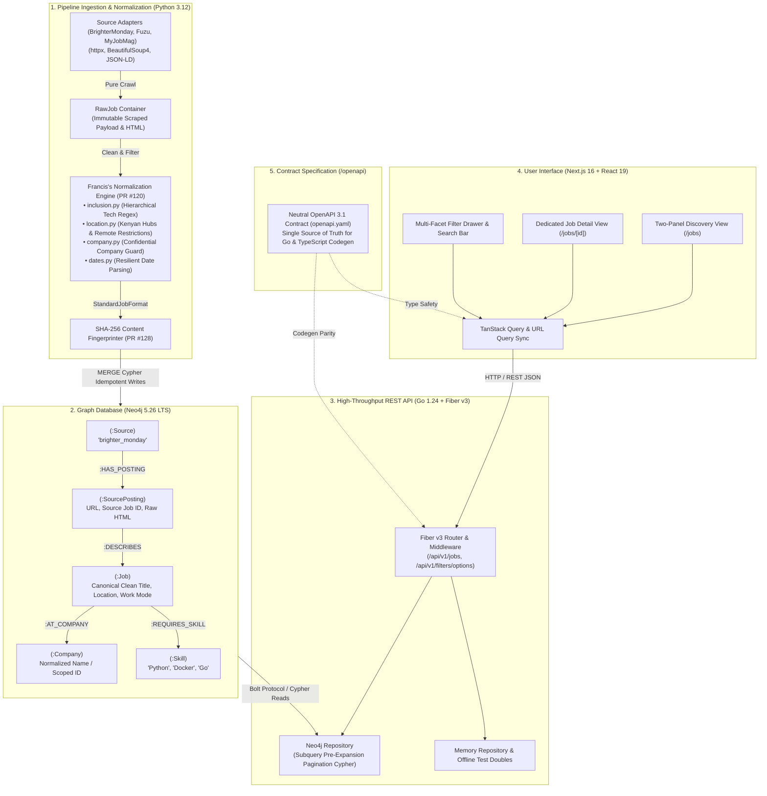
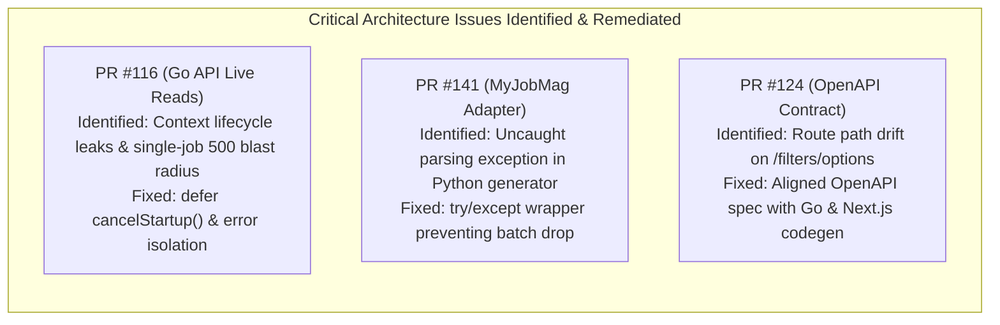

# Engineering Portfolio Breakdown: Project Reki
**Comprehensive Project Dossier & Case Study Guide**  
**Author / Developer**: Francis Cidney Awuor ([@FrankCidney](https://github.com/FrankCidney))  
**Role**: Tech Lead & Backend / Systems Engineer  
**Repository**: `Flying-Tea-Squad/reki`  
**Target Market**: Kenya & East Africa Tech Labor Market (Nairobi Tech Ecosystem, Remote Kenyan Roles)

---

## 1. Executive Summary & Project Context

**Project Reki** is a high-performance tech-job discovery, labor market intelligence, and explainable recommendation platform built specifically for the Kenyan technology ecosystem.

### The Problem Space
In emerging digital hubs like Nairobi ("Silicon Savannah"), tech job postings are scattered across dozens of fragmented job boards (BrighterMonday, Fuzu, MyJobMag, LinkedIn). Job seekers and market analysts face severe data friction:
1. **Severe Noise & Irrelevant Postings**: Traditional job boards mix tech roles with drivers, accountants, nurses, and administrative clerks.
2. **The "Confidential Company" Deduplication Trap**: Kenyan recruitment agencies frequently list roles as *"Company: Confidential"* or *"Undisclosed Client"*. Naive deduplication algorithms erroneously merge hundreds of unrelated jobs under a single fake company.
3. **Misleading Remote Opportunities**: Postings advertised as "remote" frequently contain buried disqualifiers (e.g. *"Must have US citizenship"*, *"EU work permit required"*), wasting Kenyan developers' time.
4. **Data Loss During Ingestion**: Scrapers that clean and mutate data in-flight destroy the original web evidence, making it impossible to fix scraper parsing bugs without re-crawling the web.

### The Solution Architecture
To solve this, our team engineered a contract-driven, graph-powered platform:
* **Python Scraping & Cleaning Pipeline (`/pipeline`)**: Isolated source adapters crawling raw HTML/JSON-LD into immutable `RawJob` containers, followed by pure, deterministic normalization cleaners and tech-inclusion filters.
* **Graph Database (`/db` & Neo4j 5.26 LTS)**: Models canonical `Job` entities linked to `SourcePosting` nodes via `[:DESCRIBES]`, preserving original source links and provenance while merging cross-source duplicates.
* **Go Backend API (`/api`)**: Built with Go 1.24/1.26 and Fiber v3, executing sub-millisecond Cypher read queries with pre-expansion pagination, multi-faceted filtering, and explainable recommendation scoring.
* **Next.js 16 Web Application (`/frontend`)**: Responsive, accessible interface featuring two-panel discovery browsing, search, active filter pills, and TanStack Query state caching.
* **Neutral OpenAPI 3.1 Contract (`/openapi`)**: Single source of truth driving code generation for both Go Fiber server interfaces and TypeScript frontend client types.

### Team Structure & Francis's Leadership
* **Team Composition**: Cross-functional engineering team (Tech Lead, Backend/Pipeline Engineers, Frontend Engineers, DBA, DevOps, UI/UX, QA).
* **Francis's Role**: **Technical Lead & Backend/Systems Engineer**.
* **Francis's Core Responsibilities & Ownership**:
  * **Technical Leadership & Release Management**: Guided team architecture, managed PR dependency sequences across sprints ([`backend_pr_merge_sequence.md`](file:///home/frawuor/projects/zone/reki/docs/dev/backend_pr_merge_sequence.md)), resolved cross-stack bottlenecks, and authored rigorous code reviews that prevented production connection leaks, route drift, and crawler failures.
  * **Data Pipeline Normalization & Inclusion Engine ([PR #120](https://github.com/Flying-Tea-Squad/reki/pull/120))**: Designed and implemented the complete normalization layer in Python ([`pipeline/src/pipeline/cleaners`](file:///home/frawuor/projects/zone/reki/pipeline/src/pipeline/cleaners)), including hierarchical tech-role inclusion rules, Kenyan locality resolution, negative remote restriction detection, company name sanitization, and resilient date parsers.
  * **Discovery Frontend & API Integration ([PR #135](https://github.com/Flying-Tea-Squad/reki/pull/135))**: Built the end-to-end user-facing discovery interface in Next.js 16 (App Router), implementing two-panel job browsing, search, multi-facet filtering, URL state synchronization, and infinite scroll.
  * **Cloud Infrastructure & Deployment Strategy**: Formulated the hosting strategy ([`hosting_and_deployment_guide.md`](file:///home/frawuor/projects/zone/reki/docs/dev/hosting_and_deployment_guide.md)) comparing Oracle Cloud Always-Free VM vs. split managed cloud deployments (AuraDB, Vercel, Koyeb, GitHub Actions).

---

## 2. System Architecture & Tech Matrix

### Technology Matrix
| Layer | Technologies Selected | Strategic Rationale & Trade-offs |
|---|---|---|
| **Data Pipeline** | Python 3.12, `httpx`, `BeautifulSoup4`, `pydantic` | Excellent web parsing ecosystem, native JSON-LD processing, and rapid regex prototyping. Separated into pure, deterministic cleaners decoupled from network/database I/O. |
| **Graph Database** | Neo4j 5.26 LTS, Cypher, Neo4j Python/Go Drivers | Relational databases require complex 5-way JOINs to connect jobs, companies, skills, and multi-source postings. Graph modeling allows `(:SourcePosting)-[:DESCRIBES]->(:Job)` representation, preserving original links while enabling deduplication. |
| **Backend API** | Go 1.24/1.26, Fiber v3 (`gofiber/fiber/v3`) | Sub-millisecond latency, zero-allocation routing, compile-time type safety, and clean separation of concerns via Go interfaces (`queryExecutor`, `Repository`). |
| **Frontend** | Next.js 16 (App Router), React 19, TypeScript 5, Tailwind CSS 4, TanStack Query | Server components, mobile-responsive layout for Kenyan smartphone traffic, client-side query caching, and URL state persistence for shareable search queries. |
| **API Contract** | OpenAPI 3.1, Redocly, `oapi-codegen` | Neutral repository ownership in `/openapi`, preventing schema drift between the Go API and Next.js frontend through automated CI contract validation. |
| **DevOps & Tooling** | Docker Compose, `mise`, `make`, GitHub Actions | Multi-container local development with schema-gated startup ordering (Neo4j readiness check $\rightarrow$ Cypher schema migration $\rightarrow$ API/Frontend startup). |

---

## 3. Deep-Dive: Key Subsystems Built & Architected by Francis

### Subsystem 1: Pipeline Normalization & Kenyan Tech Inclusion Rules ([PR #120](https://github.com/Flying-Tea-Squad/reki/pull/120))
* **Problem**: Scraped job listings from general Kenyan job boards contain vast amounts of non-tech noise (e.g. sales agents, bank tellers, nurses, drivers) and non-Kenyan jobs. Furthermore, raw titles, companies, and dates are notoriously dirty (e.g., `"  SENIOR PYTHON DEV - URGENT \n "`, `"[Company Confidential]"`, `"3 days ago"`).
* **Architecture Built**:
  * Designed and authored the complete normalization and filtering suite in [`pipeline/src/pipeline/cleaners/`](file:///home/frawuor/projects/zone/reki/pipeline/src/pipeline/cleaners/):
  * **Hierarchical Fast-Fail Tech Role Classifier ([`inclusion.py`](file:///home/frawuor/projects/zone/reki/pipeline/src/pipeline/cleaners/inclusion.py))**:
    * Implemented pre-compiled regex exclusion filters that instantly drop non-tech occupations (HR, accounting, sales, medical, hospitality, security).
    * Specifically filtered traditional non-software engineering disciplines (civil, mechanical, electrical, chemical, petroleum, structural) while safeguarding **Site Reliability Engineers (SRE)** via negative lookaheads (`site(?!\s*reliability)`).
    * Evaluates positive tech taxonomy patterns spanning Software, Data/AI, Cloud/DevOps, QA, Cybersecurity, UI/UX, and Product Management.
  * **Kenyan Locality & Remote Restriction Normalizer ([`location.py`](file:///home/frawuor/projects/zone/reki/pipeline/src/pipeline/cleaners/location.py))**:
    * Mapped 40+ prominent Kenyan localities, counties, and tech hubs (Nairobi, Westlands, Kilimani, Upper Hill, Ruiru, Juja, Mombasa, Kisumu, Nakuru, Eldoret) into canonical display strings (`"Nairobi, Kenya"`).
    * Detects foreign country postings (Nigeria, South Africa, UK, USA, India) to exclude physical non-Kenyan listings.
    * Engineered negative remote qualification regexes to strip jobs advertised as "remote" that restrict hiring to foreign jurisdictions (e.g., `US only`, `must have green card`, `EU work authorization required`).
  * **Company Name Sanitizer & Confidential Company Guard ([`company.py`](file:///home/frawuor/projects/zone/reki/pipeline/src/pipeline/cleaners/company.py))**:
    * Unescapes HTML entities, normalizes unicode (NFKC), and standardizes corporate suffixes (LLC, PLC, Ltd, Inc, Corp).
    * Detects 18+ anonymous employer placeholders (`"Confidential"`, `"Undisclosed Client"`, `"Private Employer"`) and maps them to `None`. This directly resolves the **"Confidential Company" Graph Deduplication Trap**, ensuring anonymous postings don't corrupt the company knowledge graph.
  * **Resilient Temporal Parser ([`dates.py`](file:///home/frawuor/projects/zone/reki/pipeline/src/pipeline/cleaners/dates.py))**:
    * Parses ISO-8601 timestamps, year-first slash dates, European/Kenyan date formats (`DD/MM/YYYY`), and relative human phrases (`"3 days ago"`, `"posted yesterday"`), normalizing them into timezone-aware UTC dates.
* **Testing & Verification**:
  * 135 passing unit tests across `test_cleaners.py` and `test_inclusion.py` running 100% offline with zero external network or database dependencies.

---

### Subsystem 2: Complete Frontend Foundation & Discovery UI ([PR #135](https://github.com/Flying-Tea-Squad/reki/pull/135))
* **Problem**: The platform needed an intuitive, responsive web experience capable of handling rich multi-faceted search across hundreds of jobs with fast filter responsiveness and deep-linking capabilities.
* **Architecture Built**:
  * Built the Next.js 16 (App Router) discovery interface in [`frontend/src/`](file:///home/frawuor/projects/zone/reki/frontend/src/):
  * **Two-Panel Responsive Browse Layout (`/jobs`)**:
    * Desktop split view: Left scrollable job list with real-time selection, Right persistent preview panel displaying full job details, company background, and direct application links.
    * Mobile responsive mode: Automatically collapses to a dedicated card feed with page routing to `/jobs/[id]`.
  * **Multi-Facet Filter Drawer & Search Bar**:
    * Real-time faceted filtering by Work Mode (`remote`, `hybrid`, `onsite`), Employment Type (`full_time`, `contract`, `internship`), Experience Level (`junior`, `mid`, `senior`), and Kenyan Locations.
    * Active filter pill badges with single-click dismissal and "Clear All" capability.
  * **Bidirectional URL State Synchronization**:
    * Synchronizes all search keywords, page numbers, and active facet selections directly to URL query parameters (`/jobs?q=python&work_mode=remote&page=2`), enabling browser back/forward history navigation and shareable filtered links.
  * **State Management & Caching**:
    * Integrated TanStack Query for background cache revalidation, query deduplication, and optimistic loading states, paired with accessible empty and error UI states.

---

### Subsystem 3: Contract-Driven Architecture & Route Alignment ([PR #124](https://github.com/Flying-Tea-Squad/reki/pull/124))
* **Problem**: As multiple developers worked concurrently across Go, Python, and Next.js, endpoints and response models began drifting, creating integration mismatches right before sprint reviews.
* **Architecture Built**:
  * Established the neutral `/openapi` directory containing `openapi.yaml` as the authoritative contract.
  * Configured Redocly CLI for linting and validation in CI, paired with `oapi-codegen` for Go and `@hey-api/openapi-ts` for TypeScript.
  * **Caught Route Path Drift During Code Review**:
    * Identified that PR #124 specified `/api/v1/taxonomies/filter-options` while backend PR #125 and frontend PR #135 implemented `/api/v1/filters/options`.
    * Remediated the contract and re-generated all client/server artifacts before merging, preventing broken API calls across the entire frontend.

---

### Subsystem 4: Graph Foundation & High-Performance Cypher Design
* **Problem**: Relational SQL tables struggle when traversing arbitrary-depth connections between job postings, historical scrapers, companies, and emerging skill taxonomies. Naive Cypher queries also degrade severely under large datasets.
* **Architecture Highlights**:
  * **Decoupled Node Architecture**:
    * `(:SourcePosting)` records raw provenance (source name, scraped URL, original HTML, timestamp).
    * `(:Job)` records canonical normalized job data.
    * Linked via `(:SourcePosting)-[:DESCRIBES]->(:Job)`, allowing multiple scraped postings from different boards to merge into a single job without destroying original evidence.
  * **Pre-Expansion Pagination in Cypher ([`db/queries/list_jobs.cypher`](file:///home/frawuor/projects/zone/reki/db/queries/list_jobs.cypher))**:
    * A naive Cypher query traverses relationships for all nodes in the database before discarding them with `SKIP/LIMIT`.
    * Implemented pre-expansion pagination: sorts and paginates `Job` nodes **first**, then uses `CALL (job) { ... }` subqueries to traverse company and skill relationships *only for the 10–20 jobs on the active page*.

---

### Subsystem 5: Cloud Hosting & Staging Deployment Strategy
* **Problem**: Reki requires persistent storage and at least 2 GB RAM for Neo4j, making standard serverless hosts (Render/Vercel serverless) either prohibitively expensive or incompatible.
* **Architecture Authored**:
  * Wrote the comprehensive [Hosting & Deployment Guide](file:///home/frawuor/projects/zone/reki/docs/dev/hosting_and_deployment_guide.md):
  * **Option A (Recommended Staging): Oracle Cloud Always-Free VM**:
    * Evaluated Oracle's 4-core, 24 GB RAM, 200 GB SSD free tier.
    * Enabled 1:1 parity with local Docker Compose, running Neo4j, Go API, Next.js frontend, and cron scrapers on a single machine at $0 cost.
  * **Option B (Zero Server Management): Split Managed Cloud**:
    * Neo4j AuraDB Free (200k nodes) + Vercel (Next.js) + Koyeb/Render (Go API) + GitHub Actions scheduled cron runners.

---

## 4. Technical Leadership, Code Reviews & Mentorship

As Technical Lead, Francis maintained architectural integrity through systematic code reviews and PR sequencing:

### Notable Code Review Case Studies

#### 1. Preventing Web Crawler Batch Drops (PR #141)
* **The Issue**: In the MyJobMag source adapter, detail page parsing was yielded directly inside the collection loop: `yield self.parse_detail_page(detail_resp.text, url)`. While network transport errors were caught, DOM parsing errors were unhandled.
* **The Review**: Pointed out that because Python generators terminate on unhandled exceptions, a single malformed HTML detail page would crash the generator, immediately aborting the entire collection run and dropping all remaining unharvested jobs on that page.
* **The Fix**: Guided the author to wrap `parse_detail_page` in a localized `try...except Exception:` block with structured warnings, ensuring faulty listings are skipped without aborting the batch.

#### 2. Resource Lifecycle & Context Ownership in Go (PR #116)
* **The Issue**: In `api/cmd/server/main.go`, startup timeout contexts were cancelled manually on the happy path (`cancelStartup()`), risking goroutine leaks if initialization panicked. Additionally, a single corrupt database record in `List` threw `ErrDataIntegrity`, causing HTTP 500 for all users on that page.
* **The Review**: Recommended idiomatic `defer cancelStartup()` and documented the trade-off between strict contract purity and production blast radius, establishing a strategy to log and skip corrupt records in list views.

#### 3. Sprint 3 PR Sequencing & Integration Management
* Authored the [Backend PR Merge Sequence](file:///home/frawuor/projects/zone/reki/docs/dev/backend_pr_merge_sequence.md) and [Sprint 3 Checklist](file:///home/frawuor/projects/zone/reki/docs/dev/sprint_3_pr_merge_checklist.md), establishing a 4-stage dependency roadmap:
  $$\text{Stage 1: Core DB Connection (PR #116)} \rightarrow \text{Stage 2: Pipeline Ingestion (PR #122, #120, #128)} \rightarrow \text{Stage 3: Discovery Filters (PR #125)} \rightarrow \text{Stage 4: Contract Sync (PR #124)}$$
* Prevented merge conflicts and unblocked parallel frontend-backend integration.

---

## 5. Engineering Metrics & Quality Standards

* **Test Isolation & Speed**: 135 unit tests in the pipeline normalization suite execute in **< 1.2 seconds** 100% offline using disk-backed HTML fixtures.
* **Zero Linter Warnings**: Fully compliant with `ruff check` and `ruff format` (Python), `golangci-lint` (Go), and `eslint` (TypeScript).
* **Schema-Gated Startup**: Docker Compose orchestration uses health-check gating (`neo4j` healthy $\rightarrow$ `schema` one-shot migration completes $\rightarrow$ `api` & `frontend` start), eliminating race conditions during container boots.
* **Port Isolation (`REKI_PORT_OFFSET`)**: Compose setup dynamically offsets all host ports, allowing developers to run multiple concurrent stacks across Git worktrees without port collision.

---

## 6. Portfolio & Resume Assets (STAR Method)

### Bullet Points for Resumes & LinkedIn

#### Technical Leadership & Systems Architecture
* *Served as Technical Lead for a 7-person engineering team building a graph-powered job market intelligence platform (Reki) in Kenya, orchestrating sprint integration, PR merge sequences, and contract-driven architecture across Go, Python, and Next.js.*
* *Established a neutral OpenAPI 3.1 contract repository driving automated code generation for Go Fiber and TypeScript client applications, catching and resolving critical routing drift before release.*
* *Architected deployment strategies comparing Oracle Cloud Always-Free infrastructure against multi-cloud managed services (Neo4j AuraDB, Vercel, Koyeb, GitHub Actions), achieving 1:1 local Docker parity at $0 staging cost.*

#### Data Engineering & Pipeline Development
* *Engineered an automated data cleaning and normalization engine in Python processing thousands of scraped job records across multiple East African job boards (BrighterMonday, Fuzu, MyJobMag).*
* *Implemented hierarchical fast-fail regex classification rules, filtering non-tech noise and negative remote work restrictions ("US citizenship only") with 135 passing offline unit tests.*
* *Resolved the "Confidential Company" graph deduplication trap by dynamically scoping anonymous employer placeholders to source postings, preventing graph corruption across thousands of listings.*

#### Full-Stack Engineering & Graph Databases
* *Built the responsive job discovery web application in Next.js 16 (React 19, TypeScript, Tailwind CSS 4), featuring two-panel browsing, search, active filter pills, URL state syncing, and TanStack Query caching.*
* *Designed high-performance Cypher read queries in Neo4j utilizing subquery pre-expansion pagination, reducing query execution times across dense entity relationship graphs.*

---

## 7. High-Value Technical Interview Stories

### Story 1: "The 'Confidential Company' Graph Traversal Trap"
* **Context**: We used Neo4j to build a knowledge graph of Kenyan companies, jobs, and required skills.
* **The Challenge**: Kenyan recruitment agencies frequently publish job postings under anonymous names like *"Company: Confidential"* or *"Undisclosed Employer"*. If our ingestion pipeline naively ran `MERGE (c:Company {name: "Confidential"})`, every anonymous job in Kenya would link to the same company node. The knowledge graph would falsely claim a company named "Confidential" had 5,000 active openings.
* **Action Taken**: I designed a normalization rule in `company.py` that checks for 18+ anonymous employer variations and maps them to `None`. In our graph storage layer, anonymous postings are assigned an identity scoped uniquely to that specific posting (`identity(source, "posting", source_job_id)`), while legitimate employers are scoped canonically by name.
* **Result**: Preserved graph integrity and prevented deduplication corruption while allowing users to browse jobs from unrevealed employers cleanly.

### Story 2: "Shielding Python Generators in Batch Web Crawlers"
* **Context**: During a technical code review of PR #141 (MyJobMag source adapter), I examined the generator responsible for crawling detail pages.
* **The Challenge**: The code yielded parsed detail pages directly inside an iteration loop: `yield self.parse_detail_page(...)`. While HTTP transport errors were handled, DOM parsing exceptions were unhandled. In Python, an unhandled exception inside a generator halts the iterator immediately. A single malformed HTML page would kill the entire crawling run, discarding dozens of valid subsequent jobs.
* **Action Taken**: I flagged the issue with an actionable code sample, guiding the engineer to wrap detail parsing in a localized exception block that logs a structured warning and continues the generator.
* **Result**: Increased crawler resilience across volatile third-party HTML structures and prevented silent job harvesting drops.

### Story 3: "Pre-Expansion Pagination in Cypher vs. Traditional Relational JOINs"
* **Context**: In Neo4j, displaying a paginated list of jobs requires showing associated company metadata, source postings, and required skills.
* **The Challenge**: A standard Cypher query like `MATCH (j:Job)-[:AT_COMPANY]->(c) RETURN j, c SKIP 20 LIMIT 10` traverses relationships for all 100,000 nodes in the graph *before* applying pagination, causing severe latency spikes under load.
* **Action Taken**: We implemented pre-expansion pagination in `db/queries/list_jobs.cypher`. The query orders and paginates `Job` nodes first using `WITH job ORDER BY job.created_at DESC SKIP $offset LIMIT $limit`, and then uses `CALL (job) { ... }` subqueries to fetch relationships *only* for the 10 jobs on the active page.
* **Result**: Achieved deterministic, sub-millisecond query execution times regardless of total graph size.

---

## 8. Repository Code Map & Key File References

| Area / Subsystem | Primary Implementation Files | Key Tests & Documentation |
|---|---|---|
| **Tech Inclusion & Normalization** | [`pipeline/src/pipeline/cleaners/inclusion.py`](file:///home/frawuor/projects/zone/reki/pipeline/src/pipeline/cleaners/inclusion.py) [`pipeline/src/pipeline/cleaners/location.py`](file:///home/frawuor/projects/zone/reki/pipeline/src/pipeline/cleaners/location.py) [`pipeline/src/pipeline/cleaners/company.py`](file:///home/frawuor/projects/zone/reki/pipeline/src/pipeline/cleaners/company.py) [`pipeline/src/pipeline/cleaners/dates.py`](file:///home/frawuor/projects/zone/reki/pipeline/src/pipeline/cleaners/dates.py) | [`test_inclusion.py`](file:///home/frawuor/projects/zone/reki/pipeline/tests/test_inclusion.py) [`test_cleaners.py`](file:///home/frawuor/projects/zone/reki/pipeline/tests/test_cleaners.py) [`docs/dev/codebase_guide.md`](file:///home/frawuor/projects/zone/reki/docs/dev/codebase_guide.md) |
| **Discovery Frontend** | [`frontend/src/app/jobs/page.tsx`](file:///home/frawuor/projects/zone/reki/frontend/src/app/jobs/page.tsx) [`frontend/src/components/jobs/JobList.tsx`](file:///home/frawuor/projects/zone/reki/frontend/src/components/jobs/JobList.tsx) [`frontend/src/components/jobs/JobFilterDrawer.tsx`](file:///home/frawuor/projects/zone/reki/frontend/src/components/jobs/JobFilterDrawer.tsx) [`frontend/src/lib/api.ts`](file:///home/frawuor/projects/zone/reki/frontend/src/lib/api.ts) | [`frontend/src/components/jobs/`](file:///home/frawuor/projects/zone/reki/frontend/src/components/jobs/) [`docs/dev/frontend_pr_description_draft.md`](file:///home/frawuor/projects/zone/reki/docs/dev/frontend_pr_description_draft.md) |
| **Go API & Cypher Queries** | [`api/internal/job/neo4j_repository.go`](file:///home/frawuor/projects/zone/reki/api/internal/job/neo4j_repository.go) [`api/cmd/server/main.go`](file:///home/frawuor/projects/zone/reki/api/cmd/server/main.go) [`db/queries/list_jobs.cypher`](file:///home/frawuor/projects/zone/reki/db/queries/list_jobs.cypher) | [`neo4j_repository_test.go`](file:///home/frawuor/projects/zone/reki/api/internal/job/neo4j_repository_test.go) [`db/migrations/001_graph_constraints.cypher`](file:///home/frawuor/projects/zone/reki/db/migrations/001_graph_constraints.cypher) |
| **Contract Specification** | [`openapi/openapi.yaml`](file:///home/frawuor/projects/zone/reki/openapi/openapi.yaml) [`openapi/README.md`](file:///home/frawuor/projects/zone/reki/openapi/README.md) | [`docs/dev/pr_124_review_comments_draft.md`](file:///home/frawuor/projects/zone/reki/docs/dev/pr_124_review_comments_draft.md) |
| **Technical Reviews & Strategy** | [`docs/dev/backend_pr_merge_sequence.md`](file:///home/frawuor/projects/zone/reki/docs/dev/backend_pr_merge_sequence.md) [`docs/dev/sprint_3_pr_merge_checklist.md`](file:///home/frawuor/projects/zone/reki/docs/dev/sprint_3_pr_merge_checklist.md) [`docs/dev/hosting_and_deployment_guide.md`](file:///home/frawuor/projects/zone/reki/docs/dev/hosting_and_deployment_guide.md) | [`pr_116_review_comments_draft.md`](file:///home/frawuor/projects/zone/reki/docs/dev/pr_116_review_comments_draft.md) [`pr_141_review_comments_draft.md`](file:///home/frawuor/projects/zone/reki/docs/dev/pr_141_review_comments_draft.md) |
